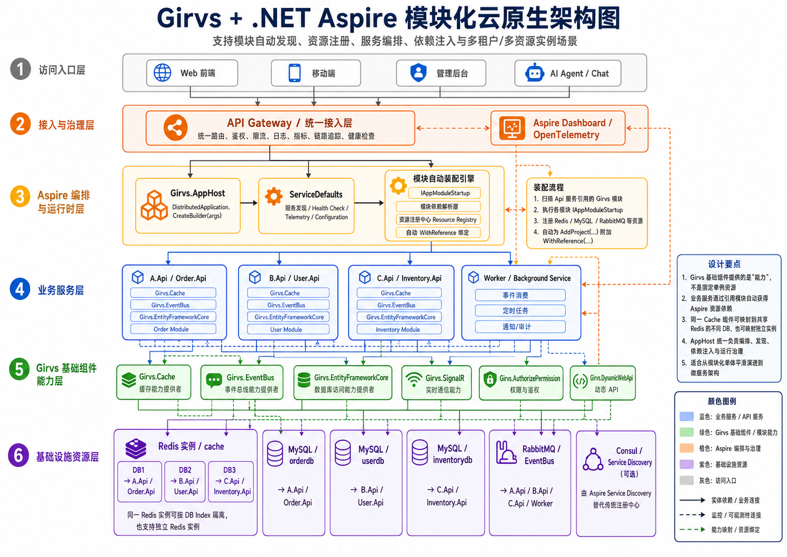

# Girvs 快速开发框架

<div align="center">

[](https://github.com/girvs/Girvs/blob/master/LICENSE)
[](https://github.com/girvs/Girvs)
[](https://dotnet.microsoft.com/)

</div>

Girvs 是一个基于 ASP.NET Core 的模块化微服务开发框架。它把数据访问、缓存、事件总线、权限认证、服务调用、服务治理、网关等常用基础设施封装为独立的 NuGet 包，**引用即启用**，通过统一的配置模型（`Resources` + `ModuleConfigurations`）完成接线，并原生支持 .NET Aspire 本地编排与 Kubernetes / Consul 部署。

---

## 目录

- [核心特性](#核心特性)
- [架构总览](#架构总览)
- [模块一览](#模块一览)
- [快速开始](#快速开始)
- [核心概念](#核心概念)
  - [启动流程](#启动流程)
  - [模块机制](#模块机制)
  - [配置体系](#配置体系)
  - [资源模型（Resources / ConnectionRef）](#资源模型resources--connectionref)
  - [依赖注入约定](#依赖注入约定)
  - [EngineContext](#enginecontext)
  - [身份上下文（ClaimsPrincipal）](#身份上下文claimsprincipal)
  - [异常处理](#异常处理)
  - [日志（Serilog）](#日志serilog)
  - [服务命名规则](#服务命名规则)
- [模块使用指南](#模块使用指南)
  - [Girvs.EntityFrameworkCore](#girvsentityframeworkcore)
  - [Girvs.Cache](#girvscache)
  - [Girvs.EventBus](#girvseventbus)
  - [Girvs.Driven](#girvsdriven)
  - [Girvs.AutoMapper](#girvsautomapper)
  - [Girvs.AuthorizePermission](#girvsauthorizepermission)
  - [Girvs.DynamicWebApi](#girvsdynamicwebapi)
  - [Girvs.OpenApi](#girvsopenapi)
  - [Girvs.Refit](#girvsrefit)
  - [Girvs.ServiceGovernance](#girvsservicegovernance)
  - [Girvs.Gateway](#girvsgateway)
  - [Girvs.Aspire.Hosting](#girvsaspirehosting)
  - [Girvs.Grpc](#girvsgrpc)
  - [Girvs.SignalR](#girvssignalr)
  - [Girvs.Quartz](#girvsquartz)
  - [Girvs.Consul](#girvsconsul)
- [部署模式](#部署模式)
- [示例项目](#示例项目)
- [开发与构建](#开发与构建)
- [已知限制](#已知限制)
- [相关文档](#相关文档)
- [许可证](#许可证)

---

## 核心特性

- **模块化、引用即启用**：每个模块实现 `IAppModuleStartup`，框架启动时反射发现并按 `Order` 执行，无需手动注册。
- **多目标框架**：通用库同时支持 `net8.0`、`net9.0`、`net10.0`；服务治理、网关等新能力面向 `net10.0`。
- **统一资源模型**：Redis、MySQL、RabbitMQ、Kafka 等连接信息集中声明在 `Resources`，各模块通过 `ConnectionRef` 引用，一份共享配置即可分发给多个服务。
- **.NET Aspire 集成**：AppHost 一行 `AddGirvsProject` 接入服务，自动写入共享配置、声明健康探针、等待依赖资源就绪。
- **统一服务治理**：服务发现（Aspire / Consul / Kubernetes）、健康检查、OpenTelemetry、HttpClient 弹性策略由一个模块提供，网关与 Refit 共用同一份服务目录。
- **标准身份模型**：基于 `ClaimsPrincipal` 与 `AsyncLocal`，身份可在 HTTP 请求、后台任务、事件总线消费之间自动传播。
- **DDD / CQRS 支持**：基于 MediatR 的命令、领域事件、领域通知与 FluentValidation 校验管道。
- **YARP 网关**：按服务目录自动生成约定路由并热更新，内置基于 Redis Lua 的严格流程防护。

## 架构总览



一个典型的 Girvs 服务由以下几层构成：

```
┌─────────────────────────────────────────────────────────────┐
│  业务服务（Startup : IGirvsStartup，Controller / 动态 API）      │
├─────────────────────────────────────────────────────────────┤
│  业务模块：Driven · AutoMapper · AuthorizePermission · Refit   │
│           DynamicWebApi · OpenApi · Grpc · SignalR · Quartz  │
├─────────────────────────────────────────────────────────────┤
│  基础设施：EntityFrameworkCore · Cache · EventBus              │
├─────────────────────────────────────────────────────────────┤
│  服务治理：ServiceGovernance（发现 / 健康检查 / OTel / 弹性）    │
├─────────────────────────────────────────────────────────────┤
│  核心：Girvs（启动、模块引擎、配置、资源模型、身份、日志、异常）    │
└─────────────────────────────────────────────────────────────┘
       ▲ 共享配置 girvs.shared.json            ▲ 流量入口
  Aspire AppHost（Girvs.Aspire.Hosting）    网关（Girvs.Gateway）
```

## 模块一览

| 包 | 说明 | 目标框架 | 主要依赖 |
|---|---|---|---|
| `Girvs` | 核心：启动、模块引擎、配置、资源模型、身份、日志、异常、仓储抽象 | net8 / 9 / 10 | Serilog、Newtonsoft.Json |
| `Girvs.EntityFrameworkCore` | EF Core 数据访问、仓储、工作单元、读写分离、多租户、分表 | net8 / 9 / 10 | EF Core、Pomelo / Microting MySql |
| `Girvs.Cache` | 统一缓存抽象（内存 / Redis / Redis 同步内存）、分布式锁 | net8 / 9 / 10 | StackExchangeRedis |
| `Girvs.EventBus` | 基于 CAP 的集成事件总线，自动传播身份 | net8 / 9 / 10 | DotNetCore.CAP |
| `Girvs.Driven` | DDD / CQRS：命令、事件、通知、校验管道 | net8 / 9 / 10 | MediatR、FluentValidation |
| `Girvs.AutoMapper` | Profile 自动发现与特性映射 | net8 / 9 / 10 | AutoMapper |
| `Girvs.AuthorizePermission` | JWT / OAuth2 认证、功能权限、数据权限、租户中间件 | net8 / 9 / 10 | JwtBearer |
| `Girvs.DynamicWebApi` | 应用服务自动暴露为 Web API，Minimal API 服务映射 | net8 / 9 / 10 | Panda.DynamicWebApi |
| `Girvs.OpenApi` | OpenAPI 文档 + Swagger UI / Knife4j / Scalar | net9 / 10 | Microsoft.AspNetCore.OpenApi |
| `Girvs.Refit` | 声明式 HTTP 客户端，支持服务发现与静态地址 | net8 / 9 / 10 | Refit |
| `Girvs.ServiceGovernance` | 服务目录、服务发现、健康检查、OpenTelemetry、Consul 注册 | **net10** | ServiceDiscovery、OpenTelemetry、KubernetesClient |
| `Girvs.Gateway` | YARP 网关：约定路由、热更新、流程防护 | **net10** | Yarp.ReverseProxy |
| `Girvs.Aspire.Hosting` | Aspire AppHost 编排扩展 | net8 / 9 / 10 | Aspire.Hosting.* |
| `Girvs.Grpc` | gRPC 服务自动注册、gRPC-Web、异常拦截 | net8 / 9 / 10 | Grpc.AspNetCore |
| `Girvs.SignalR` | Hub 自动注册与映射、Redis Backplane | net8 / 9 / 10 | SignalR MessagePack / Redis |
| `Girvs.Quartz` | 配置化定时任务 | net8 / 9 / 10 | Quartz |
| `Girvs.Consul` | 传统 Consul 注册（兼容 net8 / net9 旧部署） | net8 / 9 / 10 | Consul |

> 所有包版本由根目录 `Directory.Build.props` 统一管理，当前版本 `10.0.0-rc.4.0.3`。

---

## 快速开始

### 环境要求

- .NET SDK 10.0（见 `global.json`；只使用 net8 / net9 目标时也需要 10.0 SDK 构建本仓库）
- 可选：Docker（运行 Aspire 示例时拉起 Redis / MySQL / RabbitMQ）
- IDE：Visual Studio 2022 17.14+ / JetBrains Rider

### 1. 创建项目并安装包

```bash
dotnet new web -n Order.Api
cd Order.Api

dotnet add package Girvs --prerelease
dotnet add package Girvs.EntityFrameworkCore --prerelease
dotnet add package Girvs.Cache --prerelease
dotnet add package Girvs.ServiceGovernance --prerelease   # net10.0，接入服务发现与健康检查
```

### 2. Program.cs

```csharp
using Girvs;

var app = GirvsHostBuilderManager.CreateGirvsWebApplicationBuilder(args);
app.Run();
```

`CreateGirvsWebApplicationBuilder` 返回的是已构建好的 `WebApplication`，直接 `Run()` 即可。

### 3. Startup.cs

```csharp
public class Startup(IConfiguration configuration, IWebHostEnvironment env) : IGirvsStartup
{
    public void ConfigureServices(IServiceCollection services)
    {
        services.AddControllers();
    }

    public void Configure(IApplicationBuilder app, IWebHostEnvironment env)
    {
        app.UseGirvsExceptionHandler();

        // 框架只映射模块端点（如 /health），普通 MVC 控制器需要显式映射
        if (app is IEndpointRouteBuilder endpoints)
            endpoints.MapControllers();
    }
}
```

框架会扫描所有 `IGirvsStartup` 实现，要求其具有 `(IConfiguration, IWebHostEnvironment)` 构造函数。

### 4. appsettings.json

```json
{
  "Resources": {
    "order-mysql": {
      "Type": "mysql",
      "Settings": { "Host": "127.0.0.1", "Port": "3306", "UserName": "root", "Password": "${MYSQL_PASSWORD}", "Database": "order" }
    },
    "platform-redis": {
      "Type": "redis",
      "Settings": { "Endpoints": "127.0.0.1:6379" }
    }
  },
  "ModuleConfigurations": {
    "DbConfig": {
      "DataConnectionConfigs": [
        { "Name": "default", "ConnectionRef": "order-mysql", "ReadConnectionRefs": [], "EnableAutoMigrate": false }
      ]
    },
    "CacheConfig": {
      "DistributedCacheConfig": { "Enabled": true, "ConnectionRef": "platform-redis", "InstanceName": "order-api" }
    }
  }
}
```

`${MYSQL_PASSWORD}` 会在启动时替换为同名环境变量，避免把密码写进仓库。

### 5. 运行

```bash
dotnet run
curl http://localhost:5000/health   # 引用 Girvs.ServiceGovernance 后可用
```

---

## 核心概念

### 启动流程

`GirvsHostBuilderManager.CreateGirvsWebApplicationBuilder(args)` 依次执行：

1. `WebApplication.CreateBuilder(args)`，接入 Serilog（`HostUseSerilog`），重建配置源（`HostUseGirvsConfig`）；
2. 扫描所有 `IGirvsStartup`，调用其 `ConfigureServices`；
3. `ConfigureApplicationServices`：绑定 `AppSettings` 与所有模块配置，按 `Order` 执行各模块 `ConfigureServices`；
4. `builder.Build()`；
5. 调用各 `IGirvsStartup.Configure`，再按 `Order` 执行各模块 `Configure`（中间件管道）；
6. 按 `Order` 执行各模块 `ConfigureMapEndpointRoute`（端点映射）。

> 旧式入口 `CreateGirvsHostBuilder<TStartup>(args)`（返回 `IHostBuilder`）仍可用；拼写错误的 `CreateGrivs*` 方法已标记 `[Obsolete]`。

### 模块机制

每个模块实现 `IAppModuleStartup`：

```csharp
public interface IAppModuleStartup
{
    void ConfigureServices(IServiceCollection services, IConfiguration configuration);
    void Configure(IApplicationBuilder application, IWebHostEnvironment env);
    void ConfigureMapEndpointRoute(IEndpointRouteBuilder builder);
    int Order { get; }
}
```

- 框架通过 `WebAppTypeFinder` 扫描 bin 目录下所有程序集中的实现，用无参构造函数创建实例；
- 三个阶段均按 `Order` **升序**执行；
- 引用了模块程序集即生效，业务项目也可以自定义模块。

常见模块的 `Order`：

| 模块 | Order |
|---|---|
| `ServiceGovernanceModule` | -10000 |
| `GirvsModuleStartup`（核心）、`AutoMapperModule` | 0 |
| `GirvsCacheModule` | 1 |
| `DrivenModule` | 3 |
| `DynamicWebApiModule` | 4 |
| `GirvsEntityFrameworkCoreModule` | 5 |
| `QuartzModule` | 6 |
| `OpenApiModule` | 20 |
| `RefitModule` | 100 |
| `EventBusModule` | 50000 |
| `GrpcModule` | 99901 |
| `SignalRModule` | 99903 |
| `GirvsAuthorizeModule` | 99905 |
| `ConsulModule` | 99999 |

> `[DependsOn(...)]` 特性目前仅作为声明存在，**不参与模块排序**，排序只由 `Order` 决定。

### 配置体系

#### 配置源与优先级

`HostUseGirvsConfig` 会清空默认配置源并按以下顺序重建（后者覆盖前者）：

1. 共享配置文件：路径取环境变量 `GIRVS_SHARED_CONFIG`，未设置时读取 `girvs.shared.json`（可选，`reloadOnChange`）；
2. `appsettings.json`；
3. `Serilog.json`（兼容保留，后续计划迁移至 `appsettings.json` 的 `Serilog` 节）；
4. `appsettings.{Environment}.json`；
5. User Secrets（仅 Development）；
6. 环境变量；
7. 命令行参数。

最后执行 `${ENV_NAME}` 占位符替换：配置值中的 `${XXX}` 会被替换为同名环境变量，找不到则保留原文。

#### AppSettings 结构

```json
{
  "Resources": { },
  "CommonConfig": { "DisplayFullErrorStack": false, "Sm4SecretKey": "" },
  "HostingConfig": { "UseHttpClusterHttps": false, "UseHttpXForwardedProto": false, "ForwardedHttpHeader": "" },
  "ModuleConfigurations": { }
}
```

#### 模块配置

实现 `IAppModuleConfig` 的类会自动绑定到 `ModuleConfigurations:{类名}` 节：

```csharp
public class OrderConfig : IAppModuleConfig
{
    public int MaxItems { get; set; } = 100;
    public void Init() { }
}
```

```json
{ "ModuleConfigurations": { "OrderConfig": { "MaxItems": 200 } } }
```

读取方式：

```csharp
var config = EngineContext.Current.GetAppModuleConfig<OrderConfig>();
// 或
var config = Singleton<AppSettings>.Instance.Get<OrderConfig>();
```

> 首次启动且 `appsettings.json` 不存在时，框架会调用各配置的 `Init()` 并生成该文件；文件已存在或设置了 `GIRVS_SHARED_CONFIG` 时**不会回写**。配置绑定为启动快照，修改后需重启服务。

### 资源模型（Resources / ConnectionRef）

基础设施连接信息统一声明在顶层 `Resources`，每项由 `Type` 与 `Settings` 组成；模块配置只通过 `ConnectionRef` 引用资源键，由模块自行组装连接串。

```json
{
  "Resources": {
    "platform-redis":    { "Type": "redis",    "Settings": { "Endpoints": "redis:6379", "Ssl": "false" } },
    "order-mysql":       { "Type": "mysql",    "Settings": { "Host": "mysql", "Port": "3306", "UserName": "app", "Password": "${MYSQL_PASSWORD}", "Database": "order" } },
    "platform-rabbitmq": { "Type": "rabbitmq", "Settings": { "HostName": "rabbitmq", "Port": "5672", "UserName": "guest", "Password": "${MQ_PASSWORD}", "VirtualHost": "/" } },
    "platform-kafka":    { "Type": "kafka",    "Settings": { "BootstrapServers": "kafka:9092" } }
  }
}
```

各模块对资源类型的支持：

| 模块 | 引用字段 | 支持的 Type | 读取的 Settings |
|---|---|---|---|
| EntityFrameworkCore | `DbConfig.DataConnectionConfigs[].ConnectionRef` / `ReadConnectionRefs` | `mysql` | `Host`、`Port`、`UserName`、`Password`、`Database` |
| Cache | `CacheConfig.DistributedCacheConfig.ConnectionRef` | `redis`、`redis-synchronized-memory` | `Endpoints`（逗号分隔）、`Ssl` |
| EventBus 持久化 | `EventBusConfig.PersistenceConnectionRef` | `mysql`、`sqlserver`、`sqlite` | 数据库类：同 EF；sqlite：`DataSource` |
| EventBus 传输 | `EventBusConfig.TransportConnectionRef` | `rabbitmq`、`kafka`、`redis` | 见 [EventBus](#girvseventbus) |
| SignalR | `SignalRConfig.RedisConnectionRef` | `redis` | `Endpoints` |
| Gateway 流程防护 | 复用 `CacheConfig.DistributedCacheConfig.ConnectionRef` | `redis` | `Endpoints` |

引用的资源不存在时启动即抛出 `GirvsException("Resources:{name} 未配置")`，以便尽早发现配置错误。

**共享配置**：多个服务共用的 `Resources` 可放入 `girvs.shared.json`，通过 `GIRVS_SHARED_CONFIG` 指向；服务自身的 `appsettings.json` 永远优先于共享文件。

### 依赖注入约定

核心模块会自动按 **Scoped** 注册两类服务：

- 继承 `IManager` 的接口 → 其实现类（如 `IMediatorHandler` → `InMemoryBus`）；
- 继承 `IRepository<,>` 的自定义仓储接口（如 `IProductRepository`）→ 其实现类。

```csharp
public interface IOrderManager : IManager
{
    Task<Order> GetAsync(Guid id);
}

public class OrderManager(IRepository<Order> repository) : IOrderManager
{
    public Task<Order> GetAsync(Guid id) => repository.GetByIdAsync(id);
}
// 无需手动注册，直接注入 IOrderManager
```

其他类型请在 `Startup.ConfigureServices` 或自定义模块中手动注册。

### EngineContext

`EngineContext.Current` 提供全局服务定位能力，适合在无法构造函数注入的地方使用：

```csharp
var engine = EngineContext.Current;
var repository = engine.Resolve<IRepository<Order>>();
var principal = engine.PrincipalAccessor.Principal;
var config = engine.GetAppModuleConfig<OrderConfig>();

// 后台任务 / 消息消费中切换服务作用域（基于 AsyncLocal，可嵌套，Dispose 后还原）
using var scope = serviceProvider.CreateScope();
using (engine.ChangeCurrentThreadServiceProvider(scope.ServiceProvider))
{
    // 此处 Resolve 使用 scope 内的服务
}
```

解析优先级：`HttpContext.RequestServices` → `AsyncLocal` 中的服务提供程序 → 根服务提供程序。

### 身份上下文（ClaimsPrincipal）

身份统一使用标准 `ClaimsPrincipal`，通过 `IGirvsPrincipalAccessor` 访问：

- 优先读取当前异步执行流（`AsyncLocal`）中切换的身份，其次 `HttpContext.User`；
- `Change` / `ChangeTo` 返回 `IDisposable`，释放后还原为先前身份，**业务逻辑必须写在作用域内**。

```csharp
// 读取
var principal = EngineContext.Current.PrincipalAccessor.Principal;
var userId   = principal.GetUserId<Guid>();
var tenantId = principal.GetTenantId();
var userName = principal.GetUserName();
var type     = principal.GetIdentityType();

// 在无 Token 的入口（定时任务、回调、启动期）建立身份
using (accessor.ChangeTo(
           userId: "58205e0e-1552-4282-bedc-a92d0afb37df",
           userName: "系统管理员",
           tenantId: Guid.Empty.ToString(),
           identityType: IdentityType.ManagerUser,
           source: ExecutionSource.BackgroundJob))
{
    await DoWorkAsync();
}

// 从字典构造
using var _ = accessor.ChangeTo(new Dictionary<string, string>
{
    [GirvsClaimTypes.TenantId] = request.MerchantId,
    [GirvsClaimTypes.IdentityType] = IdentityType.ManagerUser.ToString(),
}, ExecutionSource.Http);

// 仅构造 Principal
var p = GirvsPrincipalFactory.Create(userId: "u1", tenantId: "t1");
```

框架 Claim 类型常量 `GirvsClaimTypes`：`UserId`、`UserName`、`TenantId`、`TenantName`、`IdentityType`、`SystemModule`、`UserType`、`ExecutionSource`、`ClientId`。

身份会自动跨以下边界传播：

- **Refit**：服务发现调用会透传当前请求头；
- **EventBus**：发布时序列化到 `girvs-identity` 消息头，消费时由 `GirvsCapFilter` 自动恢复；
- **审计字段**：实体构造时从当前 Principal 填充创建人、租户等字段。

### 异常处理

业务异常统一使用 `GirvsException`，默认状态码 `568`（"系统预置错误"）：

```csharp
throw new GirvsException("订单不存在", 404);
throw new GirvsException("参数错误", 400, new { field = "name" });
```

在 `Startup.Configure` 中调用 `app.UseGirvsExceptionHandler()` 后，异常会统一输出为 camelCase JSON：

```json
{ "title": "订单不存在", "status": 404, "errors": null, "traceId": "...", "stackTrace": null }
```

仅当 `CommonConfig.DisplayFullErrorStack = true` 或处于 Development 环境时输出 `stackTrace`。

### 日志（Serilog）

- 框架内置 Console sink，默认最低级别 `Information`，`Microsoft` / `System` 为 `Warning`；
- 随后读取配置中的 `Serilog` 节（`appsettings.json` 或 `Serilog.json`）；
- 需要在代码中注册 sink 时使用 `AddSerilogSink`，并可声明覆盖配置中同名的 `WriteTo` 项：

```csharp
services.AddSerilogSink(
    cfg => cfg.WriteTo.Elasticsearch(new ElasticsearchSinkOptions(new Uri("http://es:9200"))
    {
        IndexFormat = "order-api-{0:yyyy.MM.dd}",
        AutoRegisterTemplate = true,
    }),
    "Elasticsearch"); // 剔除配置中 Name=Elasticsearch 的 WriteTo 项，避免重复
```

> 由于 Console sink 已内置，配置中的 `WriteTo` 不需要再写 `Console`，否则控制台会重复输出。
> 日志使用 `ILogger<T>` 结构化模板，例如 `logger.LogInformation("服务 {ServiceName} 已发现", name)`。

### 服务命名规则

`ServiceNameResolver` 统一生成服务名，Aspire、Consul、Kubernetes、Refit、网关路由全部使用同一结果：

| 来源 | 规则 | 示例 |
|---|---|---|
| 程序集名 `FromAssemblyName` | `.` → `-`，转小写 | `Sample.ServiceA` → `sample-servicea` |
| Aspire 项目元数据 `FromProjectMetadataName` | `_` → `-`，转小写 | `Projects.Sample_ServiceB` → `sample-serviceb` |
| 配置的服务名 `FromServerName` | `.`、`_` → `-`，转小写 | `Order_Api` → `order-api` |

---

## 模块使用指南

### Girvs.EntityFrameworkCore

基于 EF Core 的数据访问层：`GirvsDbContext` 基类、泛型仓储、工作单元、主从读写分离、多租户过滤、按租户 / 按年分表、启动时自动迁移。

**配置**（`ModuleConfigurations:DbConfig`）：

```json
{
  "DbConfig": {
    "DataConnectionConfigs": [
      {
        "Name": "default",
        "ConnectionRef": "order-mysql",
        "ReadConnectionRefs": ["order-mysql-read-1"],
        "EnableAutoMigrate": false,
        "UseLazyLoading": false,
        "UseDataTracking": true,
        "EnableSensitiveDataLogging": false,
        "EnableShardingTable": false
      }
    ]
  }
}
```

| 字段 | 默认值 | 说明 |
|---|---|---|
| `Name` | `default` | 与 DbContext 上的 `[GirvsDbConfig("...")]` 对应 |
| `ConnectionRef` | — | 写库资源键 |
| `ReadConnectionRefs` | `[]` | 读库资源键，查询时随机选择 |
| `EnableAutoMigrate` | `true` | 启动时对写库执行 `Database.Migrate()` |
| `UseLazyLoading` | `false` | 启用延迟加载代理 |
| `UseDataTracking` | `true` | 是否启用变更跟踪 |
| `EnableShardingTable` | `true` | 是否启用分表 |

**实体**：

```csharp
[Table("Products")]
public class Product : AggregateRoot<Guid>,
    IIncludeMultiTenant<Guid>,   // TenantId：自动按当前租户过滤与校验
    IIncludeCreateTime,          // CreateTime
    IIncludeCreatorId<Guid>,     // CreatorId
    IIncludeCreatorName          // CreatorName
{
    public string Name { get; set; } = string.Empty;
    public decimal Price { get; set; }
    public Guid TenantId { get; set; }
    public DateTime CreateTime { get; set; }
    public Guid CreatorId { get; set; }
    public string CreatorName { get; set; }
}
```

可用的实体基类与接口：

| 类型 | 说明 |
|---|---|
| `BaseEntity<TKey>` / `BaseEntity` | 实体基类（`BaseEntity` 主键为 `Guid`），构造时自动填充审计字段 |
| `AggregateRoot<TKey>` | 聚合根 |
| `ValueObject<T>` | 值对象 |
| `IIncludeCreateTime` / `IIncludeUpdateTime` | 创建 / 更新时间（更新时自动刷新） |
| `IIncludeDeleteField` / `IIncludeInitField` | 软删除 / 初始化数据标记 |
| `IIncludeCreatorId<T>` / `IIncludeCreatorName` | 创建人 |
| `IIncludeMultiTenant<T>` / `IIncludeMultiTenantName` | 多租户 |
| `IIncludeTamperProof` | 防篡改校验码 |
| `ITenantShardingTable` | 按租户分表：表名追加 `_{tenantId}` |
| `IYearShardingTable` | 按年分表：表名追加 `_{year}` |

**DbContext**（实体必须以 public `DbSet<>` 属性暴露，框架据此建立实体与 DbContext 的映射）：

```csharp
[GirvsDbConfig("default")]
public class OrderDbContext(DbContextOptions<OrderDbContext> options) : GirvsDbContext(options)
{
    public DbSet<Product> Products => Set<Product>();
}
```

**仓储与工作单元**：

```csharp
public class ProductService(IRepository<Product> repository, IUnitOfWork<Product> uow)
{
    public async Task<Guid> CreateAsync(string name, decimal price)
    {
        var product = new Product { Id = Guid.NewGuid(), Name = name, Price = price };
        await repository.AddAsync(product);
        await uow.Commit();
        return product.Id;
    }

    public Task<List<Product>> SearchAsync(string keyword) =>
        repository.GetWhereAsync(x => x.Name.Contains(keyword));
}
```

`IRepository<TEntity>` 常用方法：`AddAsync`、`AddRangeAsync`、`UpdateAsync`、`UpdateRangeAsync`、`DeleteAsync`、`DeleteRangeAsync`、`GetByIdAsync`、`GetAllAsync`、`GetWhereAsync`、`GetAsync`、`GetByQueryAsync`（分页）、`ExistEntityAsync`。

**分页查询**：继承 `QueryBase<TEntity>` 并实现查询条件：

```csharp
public class ProductQuery : QueryBase<Product>
{
    [QueryCacheKey] public string Name { get; set; }

    public override Expression<Func<Product, bool>> GetQueryWhere() =>
        x => string.IsNullOrEmpty(Name) || x.Name.Contains(Name);
}

var query = new ProductQuery { Name = "p", PageIndex = 1, PageSize = 20 };
await repository.GetByQueryAsync(query);
// query.Result、query.RecordCount、query.PageCount
```

> 注意：
> - 写操作会校验实体租户与当前租户是否一致，不一致抛出 `GirvsException(568)`；
> - `DeleteRangeAsync(predicate)` 与 `UpdateRangeAsync(predicate, ...)` 使用 `ExecuteDelete/ExecuteUpdate`，**立即执行，不经过工作单元**。

### Girvs.Cache

统一缓存抽象 `IStaticCacheManager`，按配置自动选择实现：

| 配置 | 实现 | 分布式锁 `ILocker` |
|---|---|---|
| 未启用分布式缓存 | 内存缓存 `MemoryCacheManager` | `MemoryCacheLocker` |
| 资源 `Type=redis` | `RedisCacheManager` + `IDistributedCache` | `DistributedCacheLocker` |
| 资源 `Type=redis-synchronized-memory` | 本地内存为主、Redis 同步失效 `SynchronizedMemoryCacheManager` | `DistributedCacheLocker` |

**配置**（`ModuleConfigurations:CacheConfig`）：

```json
{
  "CacheConfig": {
    "DistributedCacheConfig": {
      "Enabled": true,
      "ConnectionRef": "platform-redis",
      "DefaultDatabase": 0,
      "InstanceName": "order-api",
      "PublishIntervalMs": 500
    }
  }
}
```

**使用**：

```csharp
public class ProductQueryService(IStaticCacheManager cache, IRepository<Product> repository)
{
    public Task<Product> GetAsync(Guid id)
    {
        var key = cache.PrepareKeyForDefaultCache(GirvsEntityCacheDefaults<Product>.ByIdCacheKey, id);
        return cache.GetAsync(key, () => repository.GetByIdAsync(id));
    }

    public async Task InvalidateAsync(Guid id)
    {
        await cache.RemoveAsync(GirvsEntityCacheDefaults<Product>.ByIdCacheKey, id);
        await cache.RemoveByPrefixAsync(GirvsEntityCacheDefaults<Product>.ListCacheKey.Key);
    }
}
```

- `CacheKey(string key, int? cacheTime = null, params string[] prefixes)`：`cacheTime` 单位为分钟，`<= 0` 时不缓存；
- `GirvsEntityCacheDefaults<TEntity>` 提供按 Id、列表、租户、查询等约定键；
- `IShortTermCacheManager`：请求级短期缓存；
- `ILocker.PerformActionWithLockAsync(resource, expiration, action)`：分布式锁执行。

> 内存模式下不注册 `IDistributedCache`，需要直接注入 `IDistributedCache` 时请使用 Redis 模式。

### Girvs.EventBus

基于 [DotNetCore.CAP](https://github.com/dotnetcore/CAP) 的集成事件总线，提供 Outbox 持久化、失败重试、Dashboard，并自动传播身份。

**配置**（`ModuleConfigurations:EventBusConfig`）：

```json
{
  "EventBusConfig": {
    "PersistenceConnectionRef": "order-mysql",
    "TransportConnectionRef": "platform-rabbitmq",
    "ConsumerThreadCount": 1,
    "SucceedMessageExpiredAfter": 60,
    "FailedMessageExpiredAfter": 1296000
  }
}
```

| 资源用途 | Type | Settings |
|---|---|---|
| 持久化 | `mysql` / `sqlserver` | `Host`、`Port`、`UserName`、`Password`、`Database`（缺省 `Girvs_EventBus`） |
| 持久化 | `sqlite` | `DataSource` |
| 传输 | `rabbitmq` | `HostName`（或 `Host`）、`Port`（默认 5672）、`UserName`、`Password`、`VirtualHost` |
| 传输 | `kafka` | `BootstrapServers`（或 `Endpoints`），可选 SASL / SSL 参数 |
| 传输 | `redis` | `Endpoints`（Redis Streams） |

**定义与发布事件**（事件为 `record`，Topic 名即事件类型名）：

```csharp
public record OrderCreatedEvent(Guid OrderId, decimal Amount) : IntegrationEvent;

public class OrderAppService(IEventBus eventBus)
{
    public Task CreateAsync(Guid orderId, decimal amount) =>
        eventBus.PublishAsync(new OrderCreatedEvent(orderId, amount));
}
```

**订阅事件**：

```csharp
using DotNetCore.CAP;
using DotNetCore.CAP.Messages;

public class OrderCreatedEventHandler(IServiceProvider serviceProvider, ILogger<OrderCreatedEventHandler> logger)
    : GirvsIntegrationEventHandler<OrderCreatedEvent>(serviceProvider)
{
    [CapSubscribe(nameof(OrderCreatedEvent))]
    public override Task Handle(OrderCreatedEvent @event,
        [FromCap] CapHeader header,   // 必须标注 [FromCap]
        CancellationToken cancellationToken)
    {
        // 此处已自动恢复发布方的身份与服务作用域
        logger.LogInformation("订单 {OrderId} 已创建", @event.OrderId);
        return Task.CompletedTask;
    }
}
```

CAP Dashboard 默认可用；Release 模式下其 PathBase 为 `/{服务名}`，便于通过网关访问。

### Girvs.Driven

基于 MediatR 的 DDD / CQRS 支持。

| 类型 | 说明 |
|---|---|
| `Command` / `Command<TResponse>` | 命令，自动记录操作描述与 IP |
| `CommandHandler` | 命令处理器基类，提供 `Commit()`、`NotifyValidationErrors()` |
| `Event` | 领域事件（`INotification`） |
| `DomainNotification` / `DomainNotificationHandler` | 领域通知，收集业务校验信息 |
| `GirvsCommandValidator<TCommand>` | FluentValidation 校验器 |
| `IMediatorHandler` | 发送命令 `SendCommand`、发布事件 `RaiseEvent` |
| `ICommandOperateHandler` | 实现后可记录命令操作日志 |

管道行为：`ValidatorBehavior`（校验失败抛出 400 `GirvsException`，或 `IsErrorMessageDelay=true` 时转为领域通知）、`CommandOperateBehavior`（操作日志）、`LoggingBehavior`（耗时与异常日志，net9+）。

```csharp
public record CreateProductCommand(string Name, decimal Price) : Command("创建产品");

public class CreateProductCommandValidator : GirvsCommandValidator<CreateProductCommand>
{
    public CreateProductCommandValidator()
    {
        RuleFor(x => x.Name).NotEmpty().WithMessage("名称不能为空");
    }
}

// 命令处理器必须继承 CommandHandler 才会被自动注册
public class ProductCommandHandler(
    IUnitOfWork<Product> uow, IRepository<Product> repository, IMediatorHandler bus)
    : CommandHandler(uow, bus), IRequestHandler<CreateProductCommand, bool>
{
    public async Task<bool> Handle(CreateProductCommand request, CancellationToken cancellationToken)
    {
        await repository.AddAsync(new Product { Id = Guid.NewGuid(), Name = request.Name, Price = request.Price });
        if (await Commit())
        {
            await bus.RaiseEvent(new RemoveCacheListEvent(GirvsEntityCacheDefaults<Product>.ListCacheKey), cancellationToken);
        }
        return true;
    }
}

// 发送命令
var ok = await bus.SendCommand<CreateProductCommand, bool>(new CreateProductCommand("p1", 9.9m));
```

内置缓存事件：`RemoveCacheEvent`、`RemoveCacheListEvent`、`RemoveCacheByPrefixEvent`、`SetCacheEvent`，以及命令 `RemoveByKeyCommand`、`RemoveByPrefixCommand`。

### Girvs.AutoMapper

自动收集实现了 `IOrderedMapperProfile` 的 Profile 并注册单例 `IMapper`；`IDto` / `IQueryDto` 类型可通过特性声明映射：

```csharp
[AutoMapFrom<Product>]
[AutoMapTo<Product>]
public class ProductDto : IDto
{
    public Guid Id { get; set; }
    public string Name { get; set; }
    public decimal Price { get; set; }
}

var dto = product.MapToDto<ProductDto>();
```

自定义 Profile：

```csharp
public class OrderProfile : Profile, IOrderedMapperProfile
{
    public int Order => 1;
    public OrderProfile() => CreateMap<Order, OrderDto>();
}
```

常用扩展：`MapToDto<TDto>()`、`MapToEntity<TEntity>()`、`MapToQuery<TQuery>()`、`MapTo<T>()`、`MergeForm(...)`。

### Girvs.AuthorizePermission

认证、功能权限（服务 + 方法两级）、数据权限与租户中间件。

**配置**（`ModuleConfigurations:AuthorizeConfig`）：

```json
{
  "AuthorizeConfig": {
    "AuthorizationModel": "Jwt, OAuth2",
    "JwtConfig": { "Secret": "${JWT_SECRET}", "ExpiresHours": 1 },
    "JwtWebFrontConfig": { "Secret": "${JWT_WEB_SECRET}", "ExpiresHours": 1 },
    "OAuth2Config": {
      "Authority": "https://auth.example.com",
      "Audience": "order-api",
      "RequireHttpsMetadata": true,
      "ValidateAudience": true
    },
    "UserDataRuleDefaultAll": true,
    "UseServiceMethodPermissionCompare": true
  }
}
```

- `AuthorizationModel` 为标志位枚举：`Jwt`、`OAuth2`、`JwtWebFront`，可组合；
- 对应认证方案常量：`GirvsAuthenticationScheme.GirvsJwt`、`GirvsJwtWebFront`、`GirvsOAuth2`；
- OAuth2 模式为资源服务器（校验外部认证服务器签发的 Token）。

**签发 Token**：

```csharp
var token = JwtBearerAuthenticationExtension.GenerateToken(
    userId: user.Id.ToString(), userName: user.Name,
    tenantId: tenant.Id.ToString(), tenantName: tenant.Name);
```

**功能权限**：

```csharp
// Startup.ConfigureServices
services.AddControllersWithAuthorizePermissionFilter(options =>
    options.Filters.Add<GirvsModelStateInvalidFilter>());

[DynamicWebApi]
[Authorize(AuthenticationSchemes = GirvsAuthenticationScheme.GirvsJwt)]
[ServicePermissionDescriptor("用户管理", "8a1b2c3d-0000-0000-0000-000000000001", "基础", SystemModule.BaseModule)]
public class UserService : IAppWebApiService
{
    [ServiceMethodPermissionDescriptor("新增", Permission.Post)]
    public Task CreateAsync(CreateUserDto dto) => Task.CompletedTask;
}
```

业务侧继承 `GirvsAuthorizeCompare` 并实现 `GetCurrentUserAuthorize()`，返回当前用户的功能权限与数据规则；权限不足时抛出 403。

**数据权限**：

```csharp
[DataRule("用户")]
public class User : AggregateRoot<Guid>
{
    [DataRule("所属部门", UserType.GeneralUser)]
    public Guid DeptId { get; set; }
}
```

仓储查询会自动叠加当前用户的数据规则条件。

**权限清单**：模块内置匿名动态 API `GirvsAuthorizePermissionService`，提供 `GetAuthorizePermissionList()` 与 `GetAuthorizeDataRuleList()`，供权限中心收集各服务的权限点与数据规则。

**租户中间件**：`GirvsTenantClaimsMiddleware` 读取请求头 `TenantId`、`TenantName`，为注册用户或匿名请求补充租户身份。

### Girvs.DynamicWebApi

基于 Panda.DynamicWebApi，把应用服务自动暴露为 RESTful API：

```csharp
[DynamicWebApi]
public class ProductAppService(IRepository<Product> repository) : IAppWebApiService
{
    public Task<Product> GetAsync(Guid id) => repository.GetByIdAsync(id);
}
```

- 自定义 Panda 选项：实现 `IDynamicWebApiModuleOptionsAction`；
- net9+ 支持 Minimal API 服务：实现 `IAppWebMiniApiService.MapServiceMiniApi(IEndpointRouteBuilder)`，框架自动映射；
- `GirvsModelStateInvalidFilter`：统一的模型校验过滤器。

### Girvs.OpenApi

基于 `Microsoft.AspNetCore.OpenApi` 生成文档（net9 / net10），**仅 Development 环境启用**：

| 用途 | 路径 |
|---|---|
| OpenAPI JSON | `/girvs_openapi/girvs_api.json` |
| Swagger UI | `/girvs_swagger` |
| Knife4j UI | `/girvs_knife4` |
| Scalar | `/girvs_scalar` |

文档自动添加两个 Server：`/`（直接访问）与 `/{服务名}`（经网关访问），存在认证方案时自动附加 Bearer 安全要求。

### Girvs.Refit

声明式 HTTP 客户端，接口继承 `IGirvsRefit` 并标注 `[RefitService]` 后即可直接注入：

```csharp
// 内部服务：通过服务发现解析地址
[RefitService("sample-serviceb", RefitServiceAddressType.ServiceDiscovery)]
public interface IServiceBRefit : IGirvsRefit
{
    [Get("/ping")]
    Task<string> PingAsync();
}

// 第三方服务：静态地址
[RefitService("partner-api", RefitServiceAddressType.Static)]
public interface IPartnerApi : IGirvsRefit
{
    [Get("/orders/{id}")]
    Task<PartnerOrder> GetOrderAsync(string id);
}

public class SelfCheckController(IServiceBRefit serviceB) : ControllerBase
{
    [HttpGet("callb")]
    public async Task<IActionResult> CallB() => Ok(new { fromServiceB = await serviceB.PingAsync() });
}
```

**配置**（`ModuleConfigurations:RefitConfig`）：

```json
{
  "RefitConfig": {
    "ServiceEndpoints": { "partner-api": "https://partner.example.com/v1" }
  }
}
```

- `Static`：地址取自 `ServiceEndpoints`，地址中的路径会拼接到请求路径之前；
- `ServiceDiscovery`：会透传当前请求头（身份、租户、链路），地址解析方式随目标框架不同：
  - **net10**：通过 [Girvs.ServiceGovernance](#girvsservicegovernance) 的服务目录解析，发现方式由 `ServiceGovernanceConfig.ServiceDiscoveryProvider` 决定；服务有多个端点时可通过 `[RefitService(name, ServiceDiscovery, endpointName: "http")]` 指定；
  - **net8 / net9**：由 `RefitConfig.DiscoveryProvider`（`Aspire` / `Consul`）与 `ConsulAddress` 决定。
- 旧构造 `RefitServiceAttribute(string, bool)` 及 `InConsul`、`ServiceAddress`、`ConsulServiceHost` 已标记 `Obsolete`，请尽快迁移。

### Girvs.ServiceGovernance

**net10.0**。服务端治理模块，引用即生效，统一提供：

- 服务目录 `IServiceDirectory`（供网关与 Refit 使用），定时刷新；
- 服务发现：`Aspire`（默认）/ `Consul` / `Kubernetes`；
- 所有 HttpClient 默认启用服务发现与标准弹性策略（`AddStandardResilienceHandler`）；
- 健康检查端点 `/health`（全部检查）与 `/alive`（存活检查），以及 gRPC 健康服务；
- OpenTelemetry Metrics 与 Tracing（设置 `OTEL_EXPORTER_OTLP_ENDPOINT` 时启用，含 CAP 追踪）；
- Consul 模式下自动注册与注销服务。

**配置**（`ModuleConfigurations:ServiceGovernanceConfig`）：

```json
{
  "ServiceGovernanceConfig": {
    "ServiceDiscoveryProvider": "Aspire",
    "DiscoveryRefreshInterval": 30,
    "MaxStaleDuration": 90,
    "HealthCheckPath": "/health",
    "LivenessCheckPath": "/alive",
    "ServerName": "",

    "ConsulAddress": "http://127.0.0.1:8500",
    "ConsulRegistrationAddress": "http://10.0.0.12:5000",
    "Interval": 10,
    "DeregisterCriticalServiceAfter": 90,
    "Timeout": 30,
    "CurrentServerModel": "WebApi",

    "KubernetesNamespace": null,
    "KubernetesLabelSelector": "girvs.io/business=true",

    "Services": {
      "sample-servicea": { "GatewayEnabled": true, "GatewayEndpointName": "http" }
    }
  }
}
```

| 字段 | 说明 |
|---|---|
| `ServiceDiscoveryProvider` | `Aspire` / `Consul` / `Kubernetes` |
| `DiscoveryRefreshInterval` | 服务目录刷新间隔（秒） |
| `MaxStaleDuration` | 服务目录超过该时长未成功刷新时，`/health` 返回 Unhealthy |
| `HealthCheckPath` / `LivenessCheckPath` | 健康 / 存活检查路径，必须以 `/` 开头；AppHost 探针同样读取此配置 |
| `ServerName` | 服务名，为空时按程序集名生成 |
| `ConsulRegistrationAddress` | 仅 Consul：本服务对外注册地址，为空则跳过注册 |
| `CurrentServerModel` | 仅 Consul：`WebApi`（HTTP 检查）/ `GrpcService`（gRPC 检查） |
| `KubernetesNamespace` | 仅 K8s：为空时列出全部命名空间（需要集群级 list 权限） |
| `KubernetesLabelSelector` | 仅 K8s：业务 Service 标签选择器 |
| `Services` | Aspire 模式下声明哪些服务对网关公开及其端点名 |

不同发现源判断"服务是否对网关公开"的方式：

| 发现源 | 服务来源 | 网关公开方式 |
|---|---|---|
| Aspire | AppHost 注入的 `services:{name}:{endpoint}:{i}` | `Services[name].GatewayEnabled` / `GatewayEndpointName` |
| Consul | 带 tag `girvs.business=true` 的健康实例 | tag `girvs.gateway-enabled=true`、`girvs.gateway-endpoint=<端点名>` |
| Kubernetes | 匹配 `KubernetesLabelSelector` 的 Service | 注解 `girvs.io/gateway-enabled: "true"`、`girvs.io/gateway-endpoint: "<端口名>"` |

Kubernetes Service 示例：

```yaml
apiVersion: v1
kind: Service
metadata:
  name: order-api
  labels:
    girvs.io/business: "true"
  annotations:
    girvs.io/gateway-enabled: "true"
    girvs.io/gateway-endpoint: "http"
spec:
  selector: { app: order-api }
  ports:
    - name: http
      port: 80
      targetPort: 8080
```

### Girvs.Gateway

**net10.0**。基于 YARP 的网关，依据服务目录生成约定路由并在服务变化时热更新。

- 路由约定：`/{serviceName}/{**catch-all}`，转发时去掉服务名前缀。例如 `GET /sample-servicea/selfcheck/cache` → `sample-servicea` 的 `GET /selfcheck/cache`；
- 只为 `GatewayEnabled = true` 且指定了 `GatewayEndpointName` 的服务生成路由；
- 自动追加 `X-Forwarded-*` 请求头。

**在 Girvs 服务中使用**（`ServiceGovernanceModule` 自动提供服务目录）：

```csharp
public class Startup(IConfiguration configuration, IWebHostEnvironment env) : IGirvsStartup
{
    public void ConfigureServices(IServiceCollection services) => services.AddGirvsGateway(configuration);

    public void Configure(IApplicationBuilder app, IWebHostEnvironment env)
    {
        if (app is IEndpointRouteBuilder endpoints)
            endpoints.MapReverseProxy();
    }
}
```

**独立网关**（不使用 Girvs 启动器）：

```csharp
var builder = WebApplication.CreateBuilder(args);

builder.Services.AddGirvsServiceDirectory(
    new ServiceGovernanceConfig { ServiceDiscoveryProvider = ServiceDiscoveryProvider.Kubernetes });
builder.Services.AddGirvsGateway(builder.Configuration);

var app = builder.Build();
app.MapReverseProxy(proxy => proxy.UseMiddleware<FlowTicketMiddleware>());
app.Run();
```

#### 流程防护（FlowProtection）

为"必须按顺序调用的多步接口"提供基于 Redis Lua 的严格线性流程控制（Ticket、步骤预占、提交、释放、过期），配置在**顶层** `FlowProtection` 节：

```json
{
  "FlowProtection": {
    "Enabled": true,
    "DefaultTtlSeconds": 300,
    "LockTtlSeconds": 30,
    "CompletedTtlSeconds": 60,
    "TicketHeaderName": "X-Flow-Ticket",
    "BusinessIdHeaderName": "X-Business-Id",
    "Flows": [
      {
        "FlowId": "user-role-bind",
        "TtlSeconds": 300,
        "Steps": [
          { "Method": "POST", "Path": "/api/user" },
          { "Method": "POST", "Path": "/api/role" },
          { "Method": "POST", "Path": "/api/bind" }
        ]
      }
    ]
  },
  "ModuleConfigurations": {
    "CacheConfig": { "DistributedCacheConfig": { "Enabled": true, "ConnectionRef": "gateway-redis" } }
  },
  "Resources": {
    "gateway-redis": { "Type": "redis", "Settings": { "Endpoints": "redis:6379" } }
  }
}
```

- 启用后需在 `MapReverseProxy` 中挂载 `FlowTicketMiddleware`；
- 每个流程至少 2 步，步骤 `Path` 按**去掉服务名前缀后的下游路径**精确匹配；
- 响应头：`X-Flow-Ticket`、`X-Flow-Next-Index`、`X-Flow-Completed`（跨域时需在 CORS 中暴露 `FlowProtectionHeaders.ResponseHeaders`）；
- 违规请求返回 403 ProblemDetails，错误码：`FLOW_NOT_FOUND`、`FLOW_EXPIRED`、`FLOW_BUSINESS_MISMATCH`、`FLOW_STEP_NOT_ALLOWED`、`FLOW_IN_PROGRESS`、`FLOW_COMPLETED`。

> 流程防护位于网关层，只适用于下游接口无法绕过网关的场景。

### Girvs.Aspire.Hosting

供 Aspire AppHost 项目引用，把基础设施与 Girvs 服务接线：

```csharp
var builder = DistributedApplication.CreateBuilder(args);

// 1. 先编排资源并登记为 Girvs 资源：资源名即服务 ConnectionRef 引用的键
builder.AddRedis("platform-redis").AsGirvsResource();
builder.AddMySql("mysql-server").AddDatabase("order-mysql", databaseName: "order").AsGirvsResource();
builder.AddRabbitMQ("platform-rabbitmq").AsGirvsResource();

// 2. 再添加服务（资源名默认按项目名生成，如 Projects.Order_Api → order-api）
var user  = builder.AddGirvsProject<Projects.User_Api>();
var order = builder.AddGirvsProject<Projects.Order_Api>().WithReference(user);

builder.AddProject<Projects.Gateway>("gateway").WithReference(user).WithReference(order);

builder.Build().Run();
```

`AddGirvsProject` 会：

1. 要求服务存在 http / https 端点，并据服务 `appsettings.json` 中的 `HealthCheckPath` / `LivenessCheckPath` 声明 Readiness / Liveness 探针；
2. **Run 模式**：等待所有已登记资源就绪，把资源地址写入 AppHost 目录下的 `girvs.shared.json`（只更新 `Resources` 节点，其余手写内容保留），并注入 `GIRVS_SHARED_CONFIG`；
3. **Publish 模式**：注入 `GIRVS_SHARED_CONFIG=/girvs-config/girvs.shared.json`，由生产 ConfigMap / Secret 挂载。

内置资源类型映射：

| Aspire 编排 | Type | 生成的 Settings |
|---|---|---|
| `AddRedis` | `redis` | `Endpoints`（含密码） |
| `AddMySql` / `.AddDatabase` | `mysql` | `Host`、`Port`、`UserName`、`Password`、`Database` |
| `AddSqlServer` / `.AddDatabase` | `sqlserver` | 同上 |
| `AddRabbitMQ` | `rabbitmq` | `HostName`、`Port`、`UserName`、`Password`、`VirtualHost` |
| `AddKafka` | `kafka` | `BootstrapServers` |

其他资源：一次性场景使用 `AsGirvsResource(type: "...", settings: ...)`；可复用场景实现 `IGirvsResourceSettingsProvider`（自动发现，无需注册，优先于内置预设）：

```csharp
public class SqliteSettingsProvider : IGirvsResourceSettingsProvider
{
    public Task<GirvsInfrastructureResource> TryBuildAsync(IResource resource, CancellationToken ct)
    {
        if (resource is not SqliteResource sqlite) return Task.FromResult<GirvsInfrastructureResource>(null);
        return Task.FromResult(new GirvsInfrastructureResource
        {
            Type = "sqlite",
            Settings = new Dictionary<string, string> { ["DataSource"] = sqlite.DatabasePath },
        });
    }
}
```

> AppHost 项目中对 `Girvs.Aspire.Hosting` 的项目引用需设置 `IsAspireProjectResource="false"`。

### Girvs.Grpc

实现 `IAppGrpcService` 的 gRPC 服务会被自动映射并启用 gRPC-Web：

```csharp
public class GreeterService : Greeter.GreeterBase, IAppGrpcService
{
    public override Task<HelloReply> SayHello(HelloRequest request, ServerCallContext context) =>
        Task.FromResult(new HelloReply { Message = $"Hello {request.Name}" });
}
```

`GirvsExceptionInterceptor` 把 `GirvsException` 转换为 `RpcException`（404 → `NotFound`，422 → `Unavailable`，其余 → `Cancelled`；非业务异常 → `Unknown`）。

### Girvs.SignalR

- 所有 `Hub` 自动注册并映射到 `/hubs/{Hub类名}`，启用 MessagePack 协议；
- 支持通过 query 参数 `access_token` 传递 JWT；
- 集群部署时配置 Redis Backplane：

```json
{
  "Resources": { "platform-redis": { "Type": "redis", "Settings": { "Endpoints": "redis:6379" } } },
  "ModuleConfigurations": { "SignalRConfig": { "RedisConnectionRef": "platform-redis" } }
}
```

```csharp
public class ChatHub : Hub { }   // 客户端连接 /hubs/ChatHub?access_token=xxx
```

### Girvs.Quartz

配置化定时任务，基于 Quartz 官方 Hosting 集成，每次触发创建独立作用域：

```csharp
public class CleanupJob(ILogger<CleanupJob> logger) : GirvsJob
{
    public override Task Execute(IJobExecutionContext context)
    {
        logger.LogInformation("清理任务执行于 {Time}", DateTime.Now);
        return Task.CompletedTask;
    }
}
```

```json
{
  "ModuleConfigurations": {
    "QuartzConfiguration": {
      "Tasks": [
        { "Name": "清理任务", "Enabled": true, "Type": "Order.Api.Jobs.CleanupJob, Order.Api", "CronExpression": "0 0/5 * * * ?" }
      ]
    }
  }
}
```

`Type` 需为程序集限定名；作业使用内存存储，不做持久化。需要身份时在 `Execute` 内用 `ChangeTo(..., source: ExecutionSource.BackgroundJob)` 建立。

### Girvs.Consul

传统 Consul 注册模块，面向尚未升级到 net10 的 net8 / net9 服务：

```json
{
  "ModuleConfigurations": {
    "ConsulConfig": {
      "ServerName": "",
      "ConsulAddress": "http://127.0.0.1:8500",
      "HealthAddress": "http://10.0.0.12:5000/Health",
      "Interval": 10,
      "DeregisterCriticalServiceAfter": 90,
      "Timeout": 30,
      "CurrentServerModel": "WebApi"
    }
  }
}
```

> net10 服务请优先使用 `Girvs.ServiceGovernance` 的 `Consul` 模式，它注册的 tag 能被网关与 Refit 的服务目录识别；不要在同一服务中同时引用两者。

---

## 部署模式

| 场景 | 服务发现 | 共享配置 | 网关发现源 |
|---|---|---|---|
| 单体 / 本地直接运行 | 无 / Refit 静态地址 | `Resources` 写在服务 `appsettings.json` | — |
| Aspire 本地编排 | `Aspire` | AppHost 生成 `girvs.shared.json` 并注入 | `Aspire` |
| Kubernetes | `Kubernetes` | ConfigMap 挂载到 `/girvs-config/girvs.shared.json` | `Kubernetes` |
| 传统 VM / Consul | `Consul` | 运维体系下发或 `appsettings.{Environment}.json` | `Consul` |

- Aspire 与 Consul 的服务端接入**按部署环境二选一**，不要在同一服务中重复注册；
- Kubernetes 模式下网关需要对 Service 的 `list` 权限（`KubernetesNamespace` 为空时需 ClusterRole）；
- 生成 Aspire 发布清单：

```bash
dotnet run --project samples/Sample.AppHost -- \
  --operation publish --publisher manifest --output-path ./publish-out
```

## 示例项目

`samples/` 目录（独立解决方案 `samples/GirvsAspireSample.slnx`，均为 net10.0，以 `ProjectReference` 直接引用框架源码）：

| 项目 | 说明 |
|---|---|
| `Sample.AppHost` | Aspire 编排入口，含自定义资源提供程序示例（`SqliteResource.cs`、`MongoSettingsProvider.cs`） |
| `Sample.ServiceA` | Web 服务：缓存 + 数据库 + Refit 调用 ServiceB |
| `Sample.ServiceB` | Web 服务：事件总线（CAP）+ 数据库 |
| `Sample.Gateway` | 网关：经 Aspire 发现转发，并在 `/girvs_swagger` 聚合各服务文档 |
| `gateway-k8s` | Kubernetes 网关验证样例（Dockerfile + k8s 清单） |

运行：

```bash
# 本机配置了 HTTP 代理时务必排除 localhost
no_proxy=localhost,127.0.0.1,::1 NO_PROXY=localhost,127.0.0.1,::1 \
  dotnet run --project samples/Sample.AppHost
```

各服务提供 `/selfcheck/*` 自检端点，详见 [samples/README.md](samples/README.md)。

## 开发与构建

```bash
dotnet build Girvs.slnx                 # 构建全部模块（默认构建即打包）
dotnet build Girvs.slnx -c Release      # 发布配置构建
dotnet test Girvs.slnx                  # 运行全部 xUnit 测试

# 仅修改单个模块时优先构建其项目
dotnet build Girvs.Gateway/Girvs.Gateway.csproj
dotnet test tests/Girvs.Gateway.Tests/Girvs.Gateway.Tests.csproj
```

测试项目：`Girvs.Core.Tests`、`Girvs.Claims.Tests`、`Girvs.Refit.Tests`、`Girvs.ServiceGovernance.Tests`、`Girvs.Gateway.Tests`、`Girvs.Aspire.Hosting.Tests`、`Sample.Gateway.Tests`。

**发布**：推送 `v*` 或数字开头的 Tag 会触发 `.github/workflows/publish-nuget.yml`，以 Tag 作为版本号执行还原、构建、测试、打包并推送到 nuget.org：

```bash
git tag v10.0.0-rc.4.0.4
git push origin v10.0.0-rc.4.0.4
```

**约定**：4 空格缩进、文件作用域命名空间、`ImplicitUsings`；跨模块公共 using 放入各模块 `GlobalUsings.cs`；提交信息采用 Conventional Commits 风格（如 `fix: 网关发现源改用结构化日志`）。详见 [AGENTS.md](AGENTS.md)。

## 已知限制

| 限制 | 说明 |
|---|---|
| EF Core 资源仅支持 `mysql` | 连接串组装要求 `Type=mysql`，其他数据库需先补充适配 |
| 服务治理、网关仅支持 net10.0 | 接入这两个模块的服务与网关需统一使用 .NET 10 |
| OpenApi 仅支持 net9 / net10 | 且只在 Development 环境启用 |
| 配置为启动快照 | 修改 `girvs.shared.json` 或资源配置后需重启服务 |
| 非 Guid 主键仓储 | 推荐使用 `IRepository<TEntity>`（Guid 主键）或自定义仓储接口 |
| 流程防护位于网关层 | 下游接口可绕过网关时无法保证流程约束 |

## 相关文档

- [框架升级说明](框架升级说明.md)：从旧版本升级的破坏性变更与迁移步骤（身份 API、资源模型、Refit、AntiJump 等）
- [Aspire AppHost 接入指南](docs/aspire/apphost-guide.md)
- [Aspire 业务升级方案](docs/aspire/升级方案.md)
- [Aspire 参照实现](samples/README.md)
- [Girvs.Gateway 说明](Girvs.Gateway/README.md)
- [Kubernetes 网关样例](samples/gateway-k8s/README.md)
- 设计与实施记录：`docs/superpowers/`

### 借鉴的开源项目

- [nopCommerce](https://github.com/nopSolutions/nopCommerce)：插件化架构、引擎与类型发现
- [ChristDDD](https://github.com/anjoy8/ChristDDD)：DDD 与 CQRS 实现
- [eShopOnContainers](https://github.com/dotnet-architecture/eShopOnContainers)：微服务架构参考

## 贡献

欢迎提交 Issue 与 Pull Request。PR 请说明修改范围、验证命令及结果；变更示例应用、网关路由或配置行为时，附上必要的日志或复现步骤。

## 许可证

本项目采用 [Apache License 2.0](LICENSE) 许可证。

- GitHub：https://github.com/girvs/Girvs
- NuGet：https://www.nuget.org/packages?q=Girvs
- 作者：kicck
